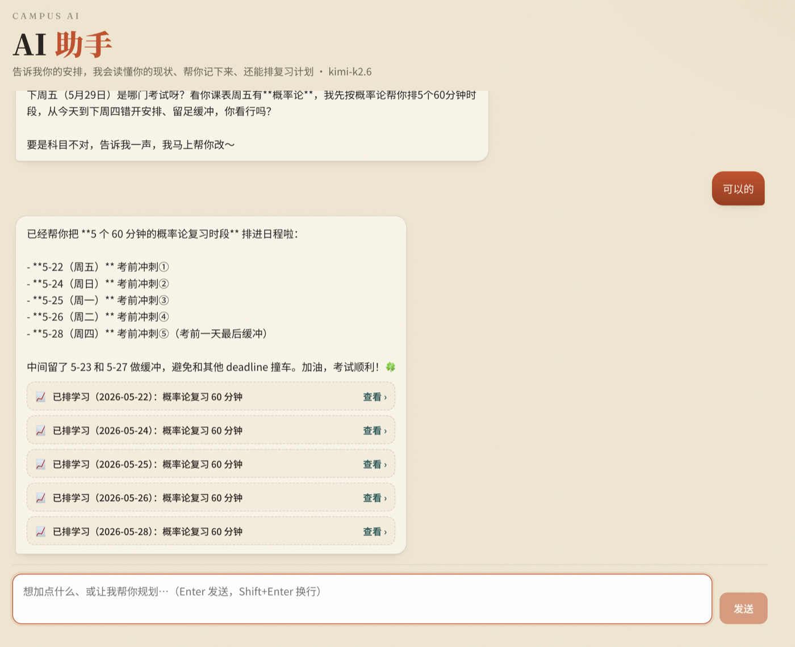

# 校园手账 · fhelper

> 一个面向大学生的校园生活助手：课程表、作业 deadline、待办、收藏、学习统计，外加一个能读懂你现状、帮你记录和规划时间的 **AI 助手**。
>
> 暖色「学术手账」风格 —— 纸张底色 · 墨色文字 · 陶土红主色 · 衬线标题。



## ✨ 功能

- **☀️ 今日总览** —— 今天的课、临近 deadline、待办与本周学习时长一屏看全
- **🤖 AI 助手** —— 和它对话，它会：
  - 读取你当前的课程 / 作业 / 待办 / 学习状态后回复
  - 在对话中判断并**自动添加**条目（课程、作业、待办、收藏、学习记录）
  - 按各科 deadline 紧迫度**自动规划复习时间**，分配到合适日期
- **🗓️ 课程表** —— 彩色周课表，按时间定位
- **📌 作业提醒** —— deadline 倒计时、优先级、按截止时间排序
- **✅ 待办清单** —— 按日期管理，进度一目了然
- **⭐ 收藏** —— 食堂 / 咖啡店 / 图书馆等校园地点，带评分
- **📈 学习统计** —— 每周柱状图 + 各科目分布

## 🛠 技术栈

| 层 | 技术 |
|----|------|
| 前端 | React + Vite + framer-motion |
| 后端 | FastAPI + SQLAlchemy 2.0 |
| 数据库 | SQLite（首次启动自动建表 + 灌示例数据）|
| AI | Kimi K2.6（Moonshot，OpenAI 兼容）+ 工具调用 |

## 🚀 快速开始

### 1. 后端

```bash
cd backend
python3 -m venv .venv
source .venv/bin/activate          # Windows: .venv\Scripts\activate
pip install -r requirements.txt
uvicorn app.main:app --reload --port 8000
```

### 2. 前端（开发模式）

```bash
cd frontend
npm install
npm run dev                        # http://localhost:5173，/api 自动代理到 :8000
```

### 3. 单进程部署（后端托管前端）

```bash
cd frontend && npm run build       # 生成 frontend/dist
cd ../backend && uvicorn app.main:app --port 8000
# 打开 http://localhost:8000
```

### 4. 启用 AI 助手

```bash
cd backend
cp .env.example .env
# 编辑 .env，填入 LLM_API_KEY=<你的 Kimi 密钥>，重启后端即可
```

密钥从 [platform.moonshot.ai](https://platform.moonshot.ai) 获取。换成 OpenAI / 本地 Ollama 等
其它 OpenAI 兼容服务时，只需改 `.env` 里的 `LLM_BASE_URL`、`LLM_MODEL`，无需改代码。
未配置密钥时其余功能照常使用，AI 页面会提示如何配置。

## 📁 项目结构

```
fhelper/
├── backend/
│   ├── app/
│   │   ├── main.py         # FastAPI 入口（建表/灌数据/挂路由/托管前端）
│   │   ├── models.py       # SQLAlchemy 模型（5 张表）
│   │   ├── schemas.py      # Pydantic 校验 / 序列化
│   │   ├── llm.py          # AI 助手：工具调用 agent
│   │   ├── config.py       # LLM 配置（读 .env）
│   │   ├── seed.py         # 首次启动示例数据
│   │   └── routers/        # 各功能 CRUD + /api/chat
│   ├── requirements.txt
│   └── .env.example
├── frontend/
│   └── src/
│       ├── pages/          # 6 个页面（含 Assistant.jsx）
│       ├── components/
│       ├── api.js          # 后端接口封装
│       └── index.css       # 设计系统
└── docs/screenshot.png
```

## 📝 说明

- 数据存在本地 `backend/campus.db`（已 gitignore），首次启动自动灌入一周的示例课程、作业与学习记录，开箱即见效果。
- AI 助手会自动执行添加操作并在对话中提示「已添加 xxx」，点击卡片可跳到对应页面查看。
